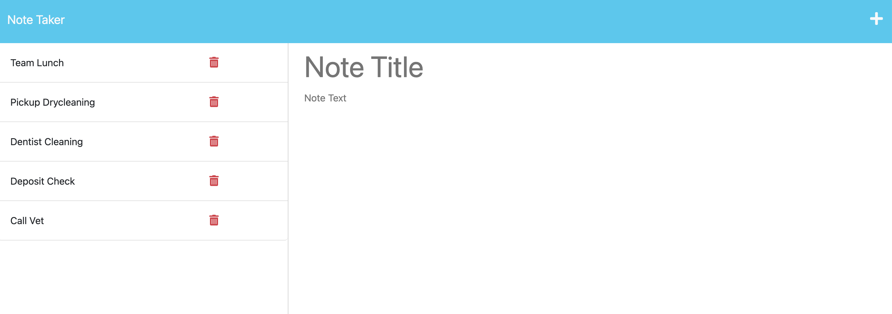

# Express.js Challenge: Note Taker App
This application can be used to create and save notes. It uses an Express.js back end and will save and retrieve note data from a JSON file. This application is deployed to Heroku.

# User Story
AS A small business owner
I WANT to be able to write and save notes
SO THAT I can organize my thoughts and keep track of tasks I need to complete

# Acceptance Criteria
GIVEN a note-taking application
WHEN I open the Note Taker
THEN I am presented with a landing page with a link to a notes page
WHEN I click on the link to the notes page
THEN I am presented with a page with existing notes listed in the left-hand column, plus empty fields to enter a new note title and the note’s text in the right-hand column
WHEN I enter a new note title and the note’s text
THEN a Save icon appears in the navigation at the top of the page
WHEN I click on the Save icon
THEN the new note I have entered is saved and appears in the left-hand column with the other existing notes
WHEN I click on an existing note in the list in the left-hand column
THEN that note appears in the right-hand column
WHEN I click on the Write icon in the navigation at the top of the page
THEN I am presented with empty fields to enter a new note title and the note’s text in the right-hand column

# Technologies Used
* Node.js
* Express.js
* HTML
* CSS
* Heroku for deployment

# Application Mock-Up/Screenshots

Homepage: 

# Installation & Usage
Open project in VS Code. Then open a terminal, and run 'Npm install' in the command line. Next, run 'npm install uuid'. Then run 'npm start'. Open link in browser, and click "get started" button to begin using the application.